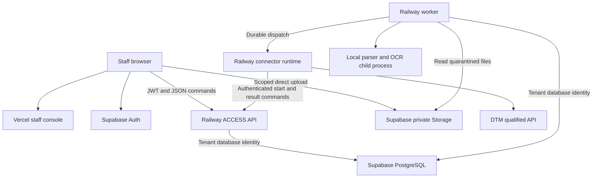

# ACCESS v1.1 architecture

## 1. Product decision

ACCESS is a standalone patient-access orchestration layer that converts inbound referrals into verified, complete and tracked outcomes inside a provider's existing systems. It receives referral documents, preserves their source, helps staff resolve identity and missing information, prepares an exact destination action, obtains approval, performs the action through a connector, and follows the access case until an appointment is confirmed or the case is deliberately closed.

The first module is **ACCESS Referral Operations**. The first complete workflow is one selected intake channel through verified DTM commitment, booking-status observation and an exception queue. ACCESS owns the access case and its referral-processing state. DTM remains authoritative for the records it accepts and the scheduling system remains authoritative for appointments. ACCESS stores external references, observations and provenance rather than presenting its local patient index as a replacement clinical record.

`COMMITTED` means that a destination write was confirmed. It is not a patient-access success. Success requires a separate observed booking or an evidenced closure outcome. Full appointment search and booking, slot reservations, clinical triage, billing, payments, scheme submissions and patient record merging are outside v1.1. Do not silently add these because the workspace is named Appointments.

The market thesis, buyer, pilot and metric definitions are in [WHITEPAPER_ALIGNMENT.md](WHITEPAPER_ALIGNMENT.md). The competing products and defensible wedge are in [COMPETITIVE_ANALYSIS.md](COMPETITIVE_ANALYSIS.md).

## 2. Fixed implementation choices

| Decision | Final choice |
| --- | --- |
| Repository | TypeScript monorepo with pnpm workspaces |
| Web | Next.js App Router, React, TypeScript, accessible staff interface on Vercel |
| Backend | Node.js current supported LTS, Fastify, Zod contracts |
| Database access | Parameterised PostgreSQL queries through pg, explicit transactions, reviewed SQL migrations |
| State | Relational tables are authoritative; immutable observations and events explain changes |
| Jobs | PostgreSQL outbox, inbox and durable timer tables; no Redis, Kafka or separate broker |
| Files | Private Supabase Storage, direct browser upload with scoped upload capability |
| Auth | Supabase Auth, asymmetric signing, server validation of token and current membership |
| Processing | Railway persistent worker; local PDF extraction and OCR for v1 |
| Execution | Isolated Railway connector runtime, DTM first, mock and manual paths included |
| Policy | Local deterministic policy and durable grants; future Inntris binding uses the same behavioural contract |
| Operational rules | Customer-owned, versioned access rules are separate from security/authority policy |
| Release | Synthetic data first; staging verification before real patient processing |

At build start, select supported package versions from official documentation and lock exact installed versions. Commit the lockfile. Do not leave floating dependency versions in a release. No specific patch version is frozen by this document.

Use SQL as the database source of truth. Generate database TypeScript types. Do not introduce an ORM that hides row locking, changes composite tenant constraints or creates a competing migration history.

## 3. Deployment topology



Deploy three Railway services initially: API, worker and connector runtime. The worker image contains bounded parser/OCR and malware scanning processes; choose a scanner distribution with updateable signatures and record scan engine/version. API and worker share domain packages and database contracts but have separate process lifecycles. Connector code holds DTM credentials and has no database connection.

Use Railway private networking for service communication where available, and authenticate service requests independently. Private networking is not a claim of per destination egress filtering. Enforce destination allowlists in connector code, reject redirects to unapproved origins and do not accept arbitrary URLs from documents or users.

The first live pilot has one tenant and one DTM connection. The schema and tests support two tenants to establish isolation. Adding tenants requires separate database login identities and explicit connector secret provisioning. Per tenant connector deployments can be introduced without changing the SPI when isolation or scale requires them.

## 4. Repository structure

```text
apps/
  web/                 Next.js console
  api/                 Fastify commands and queries
  worker/              Outbox, inbox processing, extraction, timers, reconciliation
  connector/           DTM, mock and prepared manual adapters
packages/
  contracts/           Zod schemas and shared API types
  domain/              Workflow, identity, completeness and local policy
  database/            Parameterised queries and transaction helpers
  evidence/            Canonicalisation, event hashing and effort definitions
  test_support/        Synthetic fixtures and failure controller
supabase/
  migrations/          Generated migration history created during implementation
  seed.sql             Synthetic development data only
docs/                  Architecture and operating documents
database/schema.sql    Reference definition supplied in this pack
```

## 5. Module ownership

| Module | Owns | Boundary |
| --- | --- | --- |
| Intake | Upload sessions, received messages, artefact references and provenance | No patient writes or content interpretation |
| Document | Scan status, extraction versions, source spans, confirmed fields, completeness | Never calls the destination |
| Identity | Local index, identifiers, match proposals and durable identity claims | No automatic patient merge |
| Case | Access cases, interactions, case state and observed outcomes | A destination commit alone cannot resolve a case |
| Workflow | Referral transitions, execution plans and orchestration | Sole owner of referral state changes; v1 enables only the referral case type |
| Queue | Work items, assignments, resolutions and active effort sessions | Issues workflow commands |
| Access rules | Versioned completeness, routing and follow-up rules | Does not grant authority or change an approved payload |
| Mapping | Canonical data into an immutable executable action | No transport or credentials |
| Policy | Authority rules, approvals, grants, revocation and start authorisation | No operational routing and no remote write within its transaction |
| Execution | Immutable execution records, attempts, observations and reconciliation | Connector results cannot overwrite referral state directly |
| Evidence | Event append, checkpoints and metrics projections | Does not make business decisions |

Modules may participate in one database transaction through their own repository functions. Only the owning module updates its tables. Gateway and connector processes submit commands. They do not bypass module ownership with direct writes.

No network I/O occurs inside a database transaction. External business mutations and background processing originate in durable outbox intents. Authentication/key discovery, read only status retrieval and issuance of a narrowly scoped Storage capability may run synchronously outside a transaction. Direct browser uploads are authorised intake against a precommitted upload reservation; they do not advance a referral or execute a destination action. These explicit intake and read exceptions replace the original overly broad claim that every network call must be an outbox dispatch.

## 6. Tenant and actor trust boundary

Domain tables live in private access and authz schemas. They are not exposed through the Supabase Data API. Browsers never query domain tables or hold database credentials.

Each tenant has separate API and worker database LOGIN roles. A protected principal mapping binds session_user to one tenant. All tenant tables use ENABLE and FORCE ROW LEVEL SECURITY with both read and write predicates. All relationships include the tenant identifier. Shared runtime group roles are NOLOGIN and do not grant membership in another tenant identity.

The API validates the Supabase JWT using the environment's issuer, audience and signing keys, selects the configured tenant connection, and checks current membership for the verified subject. Client supplied tenant IDs select a resource to authorise; they do not establish authority. User editable metadata never grants access.

Transaction local actor context records the verified caller. It is an audit context set by the trusted API, not a database proof that a particular human logged in. Tenant separation comes from the database login mapping, not from a writable custom setting. The API and worker remain trusted within the tenants whose credentials they hold. A full backend compromise is outside the protection offered by RLS alone.

No routine service uses postgres, a BYPASSRLS role, or a database migration credential. The connector has neither Supabase database credentials nor the Storage secret key. Storage signing credentials are a separate privileged API capability; isolate their use in a small server module, never expose private schemas to that key, and document their project wide Storage blast radius. Do not claim they have the same scope as a tenant database role.

Privileged tenant creation and login provisioning are controlled deployment tasks. Workers poll the configured tenant identities; no broadly privileged scheduler connection is required for the first release.

## 7. Intake and document processing

1. Staff creates an upload session for a tenant through the core API. An ACCESS case and its referral extension are created after the document is verified as safe; an optional draft association must not make quarantined content usable.
2. The server chooses an opaque object path and issues a scoped capability. The browser uploads directly to private Storage. No file body passes through a Vercel Function.
3. Upload completion is an idempotent command. It schedules verification; it does not trust a browser supplied hash or declare the file safe.
4. The worker checks object existence, actual size, detected MIME type and SHA256, then scans it. Limits are 20 MiB per file, PDF/PNG/JPEG only and at most 100 pages. Encrypted, malformed, unsupported and suspicious files enter review without extraction.
5. Preserve the immutable original. Extract selectable PDF text locally; use a bounded OCR process for image pages. Record page, region or character span, parser version and artefact hash for each extracted field. Keep proposed values separate from confirmed values.
6. Staff confirms patient identity fields and destination critical fields before any external write. Probabilistic scores are review aids, not automatic identity authority. An unreadable field remains unknown.
7. Completeness rules operate on confirmed values. Missing values create work items. Staff can record contact and receipt of additional information, but automated external chase messages are deferred.

A content hash identifies equal file content within a tenant. It does not automatically suppress a new referral or prove that two clinical episodes are the same. Channel idempotency keys deduplicate delivery; a possible business duplicate is a review decision.

No remote LLM is required for v1. The extraction interface permits one later, after an approved data handling and evaluation route exists. Do not send real documents to a remote model merely to make the first build work. Clinical urgency in source material is displayed as source content; ACCESS does not infer triage or treatment.

## 8. Access cases, interactions and operational rules

`access_cases` is the stable platform aggregate. It carries a case type, source channel, high-level lifecycle, patient link, rule-set binding and optimistic version. A referral is a one-to-one extension for the enabled `REFERRAL` case type. Other reserved case types and channels remain disabled until their own contracts and acceptance evidence exist.

Every inbound, outbound or internal touch that changes understanding of a case is an immutable interaction with a channel, direction, actor class, intent, identity-verification level and restricted content reference. Raw clinical narrative or message bodies remain in protected artefacts; the interaction record does not become a second document store.

Operational access rules define completeness, routing, allowed closure reasons, follow-up intervals and booking-readiness requirements. They are versioned and customer owned. A case binds the version under which it is evaluated. Publishing an operational rule does not authorise a user or connector, and authority policy cannot silently change operational meaning. Any rule or mapping change affecting an already approved action invalidates that action and requires a fresh plan.

## 9. Identity and patient creation

Use identifiers with explicit type, issuer/country and normalisation version. A checksum or format check does not establish ownership. Persist provenance and verification status. Store searchable identifiers as tenant keyed HMAC digests; plain identifier values belong only in protected patient/document records. Do not use a public SHA256 of an identity number as anonymisation.

The matching engine returns deterministic candidates, review candidates or no supported match. All proposed links require confirmation in v1. Deterministic matching must reject contradictions. Probabilistic matching is explainable and suggestion only; no numeric automation threshold is assumed to be validated.

A durable identity claim coordinates creation under a reliable identifier. Recheck local and external observations after claiming, without holding a database transaction during external reads. Commit observations through commands and revalidate claim ownership and current state before preparing creation. A claim remains reserved while any associated external attempt may still commit. Worker lease expiry never releases identity ownership.

The destination may also receive writes from staff or another integration. Local claims cannot exclude those. Destination uniqueness or explicit conflict resolution is required. Different identifier namespaces that cannot reliably be linked enter review.

## 10. Executable action and approval

Prepare the connector payload before authorisation. Freeze destination identity, operation, HTTP method, path template resolution, relevant semantic headers, canonical body, mapping version and capability snapshot. Canonicalise according to RFC 8785 and hash the complete versioned action envelope. Transport credentials, trace IDs and volatile auth headers are added later and excluded; fields changing the action's meaning are included.

All external writes require human approval in v1. The UI may approve a list of final action hashes in one interaction, but it must enumerate each operation and destination. Never treat approval of a referral as blanket approval for future mutated payloads. Changes produce a new plan and require fresh approval. Cancel only work that has not started; started work requires reconciliation.

Each side effect has its own execution ID and immutable action. Dependent operations use an explicit sequence and resolved prerequisites. For a new patient, patient.create completes first; only then can referral.create be mapped and approved with the verified external patient reference. Document attachment follows verified referral creation. Do not authorise placeholder destination IDs or a future payload whose hash is unknown.

Local policy implements evaluate, issue_grant, authorise_and_start, revoke and record_outcome as specified in CONTRACTS. A future Inntris binding must pass the same conformance cases. There is no assertion that the currently existing Inntris implementation already meets this contract.

## 11. Authoritative execution start

The connector authenticates as the configured executor and requests permission to start. The core starts a short transaction and locks the tenant authority guard first. Membership changes, policy publication, approval revocation and integration disabling use the same guard.

Within this transaction the core checks the action hash, current policy, active membership, approval, executor binding, expiry, connector capability snapshot, unresolved predecessors and identity claim where relevant. It consumes an unused grant, creates the attempt and records execution STARTED, with its event, atomically.

Only the transaction that actually starts the attempt returns a one use dispatch permission. A repeated start request returns durable status without permission to send again. The connector performs the external operation after commit. A lost start response or crash after start creates uncertainty; recovery must not invent a replacement dispatch permission.

This is the authorisation boundary. A revocation that commits before it blocks the action. Revocation after it cannot promise to recall an operation already authorised to start. No database transaction includes a foreign call, and no claim is made of atomicity with the remote PMS.

## 12. Uncertainty and retry

An external timeout is an uncertain observation. The original attempt might still commit. A local cancelled task, expired lease, terminated process or negative eventually consistent search does not prove absence.

Automatic repeat dispatch requires a verified destination idempotency contract still valid for the same key and payload, or authoritative evidence that all prior attempts neither committed nor can still commit. A unique destination key qualifies only when enforced atomically alongside the relevant effect. Define key retention, scope and payload mismatch handling in the capability snapshot.

Every new dispatch attempt gets current authorisation and an unused attempt grant while retaining the logical execution ID and frozen action. Once destination deduplication retention expires, automatic retry stops. Every uncertain route retains its identity claim and blocks dependent effects. Manual investigation is available throughout.

Manual prepared completion is separate from uncertain outcome resolution. A human cannot safely create again just because automation is unresolved. Human completion records who acted, what they attested and the external evidence. It is labelled human attestation until independently verified; it is not presented as cryptographic proof of exact external execution.

## 13. Outcomes and command consistency

Connector observations enter a durable inbox through authenticated commands. Record source identity, execution/attempt binding, observation ID and payload hash before reconciling workflow. Duplicate messages are no ops. Contradictory or mismatched observations enter investigation rather than overwriting established facts.

Human commands use expected_version and return a conflict on stale state. External observations are retained even if the referral version changed. Reconciliation decides the next business transition. An observed external success cannot disappear because the referral was cancelled or edited meanwhile.

Outbox leases allocate processing work; they never establish exactly once delivery. Enforce earliest unresolved sequence and dependency predicates in the claim transaction. Do not rely on lock acquisition order. No advisory lock spans HTTP calls.

A confirmed destination write advances the referral to `COMMITTED`; it does not close the case. The case remains active until an immutable outcome observation establishes `APPOINTMENT_BOOKED` or an enumerated closure such as patient declined, patient unreachable, invalid referral or referred elsewhere. `UNKNOWN_STATUS` remains unresolved and is never included in the successful-booking numerator. Connector, human, import and derived outcomes remain distinguishable.

## 14. Evidence and measurement

Write every domain transition, its evidence event and any resulting intent in the same transaction. Event payloads contain minimal references and reason codes, not raw documents, patient identifiers or unrestricted feature vectors. Data minimisation applies to logs, errors and traces too.

Store event schema/hash versions, canonical bytes or reproducible canonical representation, sequence and previous hash. Serialise the chain head per tenant. Periodically retain signed checkpoints independently of the primary database before claiming detection of privileged rewriting. A chain without such checkpoints provides consistency evidence with a narrower trust claim.

Measure active staff effort through explicit sessions with pause, resume and inactivity handling. Allow observed offline effort entry with source, estimated effort and unknown effort as separate categories. Do not substitute elapsed queue time for active labour or unknown values with zero.

Report referral-to-booking conversion, time to destination commitment, time to booking, active staff minutes, contacts, status enquiries, correction rate, unresolved execution rate and workload by cohort. Define the denominator, inclusion rules and baseline before comparing. Keep observed, derived, estimated and unknown outcomes distinguishable. Never present automatic transport after human approval as a fully unattended referral or infer realised revenue without customer-supplied economics. The ACCEPTANCE document specifies the reporting checks.

## 15. Operational defaults

Use bounded worker concurrency and jittered scheduling. Initial limits are one OCR job per worker and two connector operations per tenant, with one unresolved dependent operation per referral. Capability contracts can lower these limits. Queue saturation produces an explicit retryable capacity response or durable backlog status, never silent loss.

Use UTC timestamps and database time for grant expiry, leases and timers. Display dates and times in Africa/Johannesburg by default. Preserve source timezone where it has meaning.

Set HTTP and processing timeouts explicitly, and distinguish a client deadline from proven destination cancellation. Keep full patient data out of observability. Record service readiness, queue age, stale attempts, unknown outcomes, scan failures and membership denial counts.

Backups, Storage recovery, retention and rollback follow DEPLOYMENT. They are part of the release criteria, not implications of choosing a managed database.

## 16. Scope deferred

Defer remote Inntris enforcement, remote LLM extraction, a deidentification vault service, WhatsApp, voice, inbound email infrastructure, additional PMS adapters, patient merge, autonomous identity linkage, outbound chases, appointment search/booking, slot optimisation, insurance authorisation, clinical triage, billing, multi region failover and per tenant pods.

Do not defer tenant constraints, authentication, private file handling, source provenance, durable uncertainty, current approval enforcement, result retention or manual investigation. These are included in the first working workflow.
